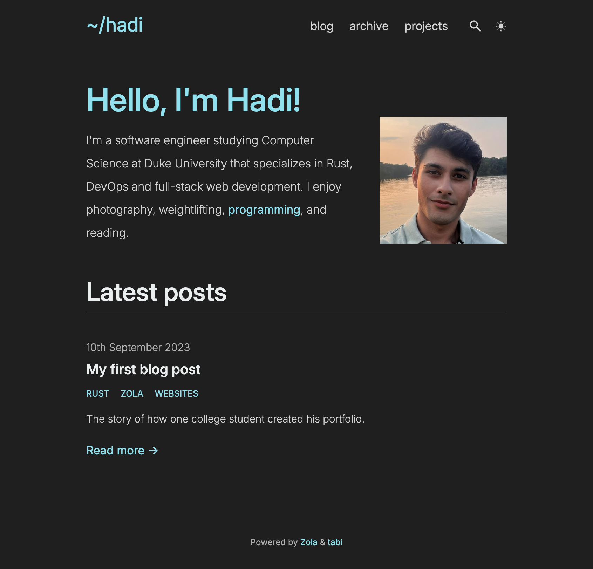

# Personal Website   

This is the source code for my [personal website](https://hadichaudhri.github.io). It's built off of the [tabi](https://github.com/welpo/tabi) theme for the [Zola](https://www.getzola.org/) static site engine.

## Dependencies

-   [Zola](https://www.getzola.org/)
-   [tabi](https://github.com/welpo/tabi)

## Development

Start the web server: `zola serve`

## Production

Build the website: `zola build`
